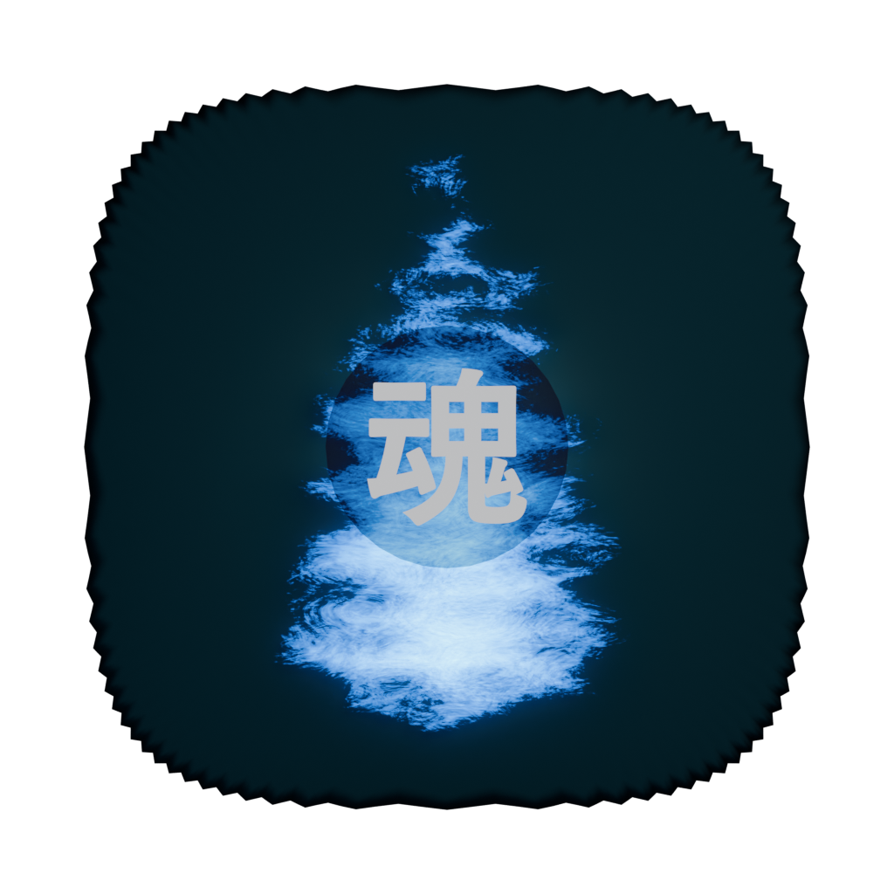
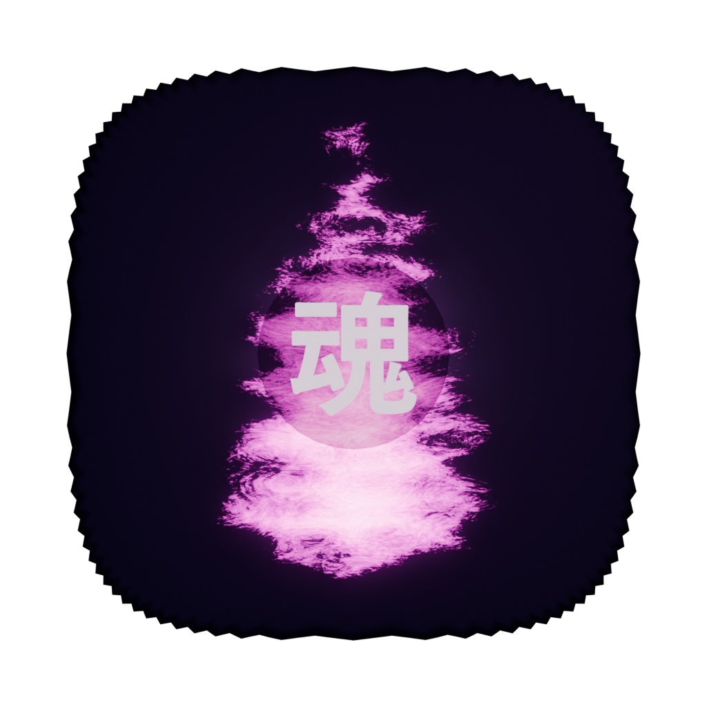

<p align="center">
  
</p>

<h1 align="center">Tamashii (魂)</h1>

<p align="center">
  <strong>Personal Focus & Recovery App</strong><br/>
  Stay disciplined. Break bad habits. Build a better you.
</p>

<p align="center">
  
  
  
  
  
  
</p>

---

## What is Tamashii?

**Tamashii** (魂 — Japanese for "soul/spirit") is a personal productivity and recovery desktop + mobile app. It helps you maintain discipline and break destructive habits through:

- **Hardcore website blocking** — time-locked, tamper-protected, you can extend but *never* shorten or disable
- **Streak tracking** — real-time `DD:HH:MM:SS` counter that persists across restarts
- **Panic button** — guided breathing exercises and grounding techniques for moments of weakness
- **Journaling** — mood-tracked entries to reflect on your journey
- **Achievements** — 25 unlockable badges across 5 categories
- **Daily motivational quotes** — native OS notifications at your configured time
- **3D anime mascot** — VRM companion that reacts to your streak progress (anime mode)

---

## Screenshots

### Three Themes

| Dark Mode | Light Mode | Anime Mode |
|:---------:|:----------:|:----------:|
| Cyan accent, near-black bg | Teal accent, clean white bg | Pink accent, 3D mascot, sparkles |

### Theme-Adaptive Logo

<p align="center">
  
  
  
</p>

---

## Features

### Dashboard
- Live streak counter with real-time ticking display (JetBrains Mono)
- Daily motivational quote with refresh
- Quick stats (best streak, blocked sites, journal entries)
- Panic button with pulsing red glow
- Blocker status with lock countdown

### Website Blocker (Hardcore Mode)
- **7 categories**: Adult Content (150+), Social Media (33), Gambling (24), News (24), Entertainment (19), Gaming (19), Shopping (15) — **350+ domains** total
- Time-locked activation: 24h, 48h, 7 days, 30 days, 90 days
- **Cannot disable or shorten** — only extend
- Hosts file blocking on Windows (`C:\Windows\System32\drivers\etc\hosts`)
- Tamper protection: background Rust task re-applies entries every 60 seconds
- System tray persistence — closing the window doesn't stop blocking
- Auto-start on boot — survives reboots

### Panic / Emergency Page
- **Breathing exercise**: Animated circle with 4-4-6 breathing pattern (GSAP timeline)
- **5-4-3-2-1 Grounding**: Interactive checklist for sensory grounding technique
- **Your reasons**: Customizable reminders of why you started
- **Productive actions**: Quick links to redirect your energy

### Statistics
- **Calendar heatmap**: GitHub-style activity grid showing streak and reset days
- **Streak history**: Visual timeline of all your streaks
- **Weekly summary**: Comparison bars with progress tracking

### Journal
- Mood-tracked entries (5 emoji moods)
- Rich text editor
- Searchable entry list with smooth animations

### Achievements
- **25 badges** across 5 categories:
  - Streak (9): First Day, One Week, One Month, 90 Days, One Year...
  - Blocker (5): First Lock, Category Collector, Extended Lock...
  - Journal (5): First Entry, Week of Writing, 100 Entries...
  - Panic (3): First SOS, Breathing Master, Grounding Pro
  - Special (3): Night Owl, Early Bird, Completionist
- Locked badges show progress bars
- Unlock animations with glow effects

### 3D Anime Mascot (Anime Mode)
- Full 3D VRM character rendered with Three.js + React Three Fiber
- Girl or Boy character (selectable in settings)
- **Expression system**: Changes based on streak progress
  - Neutral → Determined → Happy → Joyful → Relaxed → Celebrating
- Idle animations: breathing, random blinking, eye tracking
- Context-aware speech bubbles with dialogue for milestones

### Daily Notifications
- Motivational quote delivered as native OS notification
- 110 quotes across 4 categories (motivation, discipline, recovery, productivity)
- Configurable notification time (default 09:30 AM)
- Rust tokio scheduler runs in background

---

## Tech Stack

| Layer | Technology |
|-------|-----------|
| **Framework** | Tauri v2 |
| **Frontend** | React 19 + TypeScript |
| **Backend** | Rust |
| **Styling** | Tailwind CSS v4 |
| **State** | Zustand 5 |
| **Routing** | React Router 7 |
| **Database** | SQLite (tauri-plugin-sql) |
| **3D Engine** | Three.js + @react-three/fiber + @pixiv/three-vrm |
| **Animations** | Framer Motion + GSAP |
| **Icons** | Lucide React |
| **Bundler** | Vite 7 |

### Typography
| Role | Font |
|------|------|
| Logo & Display | **Orbitron** (Bold) |
| Numbers & Code | **JetBrains Mono** (Variable) |
| UI Body Text | **Inter** (Variable) |
| Anime Mode | **Zen Maru Gothic** (Regular, Medium, Bold) |

---

## Installation

### Windows

Download the latest installer from the [Releases](https://github.com/naveenkarasu/Tamashii/releases) page:

- **`Tamashii_0.1.0_x64-setup.exe`** — NSIS installer (recommended)
- **`Tamashii_0.1.0_x64_en-US.msi`** — MSI installer

> **Note**: The app requires administrator privileges for website blocking (hosts file modification). Windows will prompt for UAC elevation on first launch.

### Android

Download the APK from [Releases](https://github.com/naveenkarasu/Tamashii/releases):

- **`Tamashii_0.1.0_android.apk`** — Android APK

> **Note**: Enable "Install from unknown sources" in your Android settings to sideload the APK. Website blocking is not available on Android (hosts file is read-only without root).

### Build from Source

```bash
# Prerequisites: Node.js 18+, Rust 1.77+, Tauri CLI

# Clone the repository
git clone https://github.com/naveenkarasu/Tamashii.git
cd Tamashii

# Install dependencies
npm install

# Development mode (frontend only)
npm run dev

# Development mode (full Tauri app)
npm run tauri dev

# Production build (Windows)
npm run tauri build

# Android build
# Requires: Android SDK, NDK 27+, JDK 17
npx tauri android init
npx tauri android build --apk
```

---

## Project Structure

```
Tamashii/
├── src/                          # React frontend (TypeScript)
│   ├── main.tsx                  # Entry point
│   ├── App.tsx                   # Root component (theme + router)
│   ├── router.tsx                # Route definitions
│   ├── index.css                 # Tailwind v4 + theme CSS variables
│   ├── types/                    # TypeScript interfaces
│   ├── lib/                      # Data & utilities
│   │   ├── database.ts           # SQLite init (8 tables)
│   │   ├── theme.ts              # Theme definitions
│   │   ├── achievements.ts       # 25 achievement definitions
│   │   ├── blocklists.ts         # 350+ blocked domains
│   │   ├── quotes.ts             # 110 motivational quotes
│   │   └── mascotDialogues.ts    # Mascot speech contexts
│   ├── store/                    # Zustand state stores
│   │   ├── appStore.ts           # Theme, mascot, notifications
│   │   ├── streakStore.ts        # Streak tracking
│   │   ├── blockerStore.ts       # Blocker state & lock
│   │   └── achievementStore.ts   # Achievement progress
│   └── components/               # React UI components
│       ├── layout/               # AppShell, TopBar, Sidebar
│       ├── dashboard/            # Streak counter, quote, stats, panic btn
│       ├── blocker/              # Categories, lock status, activation
│       ├── panic/                # Breathing, grounding, actions
│       ├── stats/                # Heatmap, history, weekly summary
│       ├── journal/              # Editor, entries, mood tracking
│       ├── achievements/         # Badge gallery
│       ├── settings/             # Theme, mascot, notifications
│       ├── anime/                # VRM mascot, dialogue, sparkles
│       ├── background/           # Mesh gradient
│       └── shared/               # Button, Card, Modal, Toggle, ProgressBar
├── src-tauri/                    # Rust backend
│   ├── src/
│   │   ├── lib.rs                # App setup (plugins, tray, scheduler)
│   │   ├── commands/             # Tauri IPC commands
│   │   │   ├── blocker.rs        # apply/remove blocklist, status, admin
│   │   │   └── streak.rs         # get/save streak data
│   │   ├── blocker/
│   │   │   ├── hosts.rs          # Windows hosts file manipulation
│   │   │   └── watcher.rs        # 60s tamper-protection re-apply
│   │   └── scheduler/
│   │       └── quote_scheduler.rs # Daily notification at configured time
│   └── tauri.conf.json           # Tauri config
├── public/
│   ├── logo.png                  # Default logo
│   ├── logo-dark.png             # Dark theme logo
│   ├── logo-light.png            # Light theme logo
│   ├── logo-anime.png            # Anime theme logo
│   └── models/                   # VRM mascot models
│       ├── girl.vrm
│       └── boy.vrm
└── design/
    └── base-logo.blend           # Logo Blender source file
```

---

## Themes

Tamashii features three distinct visual themes:

### Dark Mode (Default)
- **Accent**: Neon cyan `#22d3ee`
- **Background**: Near-black `#09090b`
- **Style**: Gaming dashboard aesthetic, neon glows

### Light Mode
- **Accent**: Teal `#0891b2`
- **Background**: Clean white `#fafafa`
- **Style**: Professional, minimal

### Anime Mode
- **Accent**: Hot pink `#f472b6`
- **Background**: Deep purple `#0d0015`
- **Style**: Gradient borders, sparkle particles, 3D VRM mascot, Zen Maru Gothic font

---

## How Blocking Works

1. Select categories and lock duration
2. Type "LOCK" to confirm (prevents accidental activation)
3. Rust backend writes domains to Windows hosts file with `# === TAMASHII START/END ===` markers
4. Background task re-checks and re-applies every 60 seconds (tamper protection)
5. App minimizes to system tray — closing the window doesn't stop blocking
6. Auto-start on boot ensures blocking persists across reboots
7. When lock expires, categories become toggleable again

**You can only extend the timer, never shorten it.** This is by design.

---

## Database

SQLite database (`tamashii.db`) with 8 tables:

| Table | Purpose |
|-------|---------|
| `settings` | App preferences |
| `streaks` | Streak start/best/resets |
| `block_categories` | Enabled block categories |
| `blocked_domains` | Custom blocked domains |
| `achievements` | Unlock status & dates |
| `journal_entries` | Journal entries with mood |
| `daily_logs` | Daily activity tracking |
| `quotes` | Motivational quotes pool |

All data is stored **locally only** — nothing leaves your device.

---

## Platform Support

| Feature | Windows | Android |
|---------|:-------:|:-------:|
| Website blocking (hosts) | Yes | No (no root) |
| Tamper protection | Yes | N/A |
| System tray | Yes | N/A |
| Auto-start on boot | Yes | No |
| Streak tracking | Yes | Yes |
| Journal | Yes | Yes |
| Achievements | Yes | Yes |
| Notifications | Yes | Yes |
| 3D Mascot | Yes | Yes |
| Themes | Yes | Yes |

---

## License

[MIT License](LICENSE) - Copyright (c) 2026 Naveen Karasu
